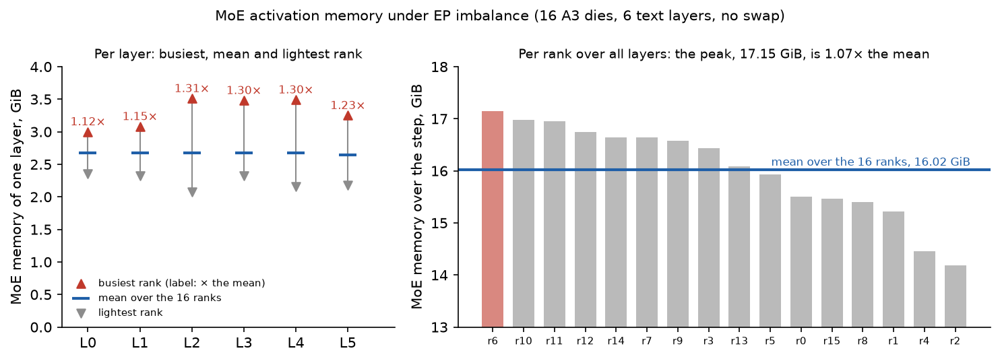
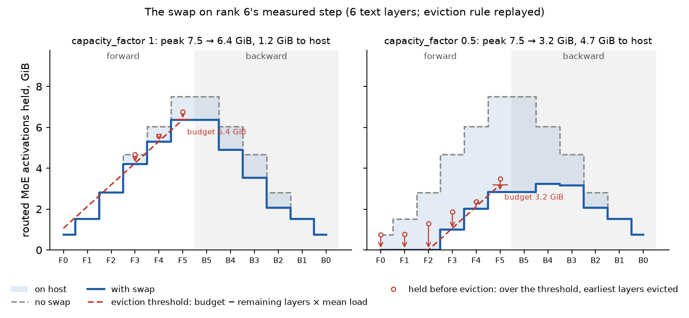
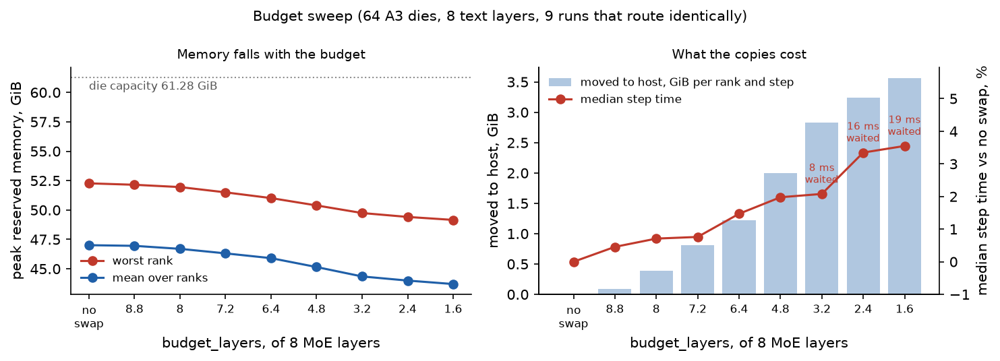

# MoE host swap

Under expert parallelism the router decides, every step, how many tokens each rank
receives, and so how much activation memory each rank's MoE layers keep for
backward. `ep_host_swap` bounds that memory by a number the routing cannot change:
each rank ends every forward pass holding at most `budget_layers` **mean layers** of
these activations, and swaps the rest to pinned host memory. A mean layer is what
one MoE layer keeps when a rank receives exactly the tokens it sends. No token is
dropped and the gradients are unchanged.

On 16 Ascend A3 dies (Qwen3-VL-30B-A3B, FSDP 16, EP 16) it cut the worst rank's
reserved memory by 1.5 to 5.4 GiB for 0 to 3% of step time, with every copy hidden.

## The problem



Each MoE layer keeps 8.7 KB per token-expert pair a rank received. Within a layer
the busiest rank holds up to 1.31 times the mean, and the lightest well below it
(left), and the busiest rank changes
from layer to layer and from step to step. Every rank peaks at the end of forward,
holding all its layers at once, so what decides an out-of-memory is each rank's
total over the pass (right). Without a bound, memory has to be provisioned for the
worst routing ever seen.

## How it works



- **Budget.** `budget_layers` mean layers per rank. A rank's mean layer follows from
  its own tokens times top-k, known before routing, so the budget needs no collective
  and no routing can move it.
- **Trigger.** After each MoE layer the rank projects its end-of-forward total: what it
  holds plus the remaining layers at one mean layer each. While the projection is
  over the budget, it evicts. On the figure this is a threshold on what the rank
  holds (red), `budget − (L − i) × mean layer`, rising by one mean layer per layer
  to the budget at the last one; a circle is what the rank held before an eviction.
  Keeping room for the remaining layers settles most evictions early in the pass,
  and leaves little to evict after the last layer, when copies would still run at
  the step's peak. A rank that is heavy early but light later moves nothing.
- **What moves.** Whole tensors the experts saved for backward, earliest layers
  first: their backward comes last, so their copies have the most time on both ends.
  Copies run on a side stream during the next attention and are never waited for.
- **Coming back.** A swapped layer is copied back while the layer above it runs
  backward, so the reload lands after backward has freed most activations.
- **Under one mean layer per layer**, every rank evicts every step (right panel):
  the budget becomes a memory setting rather than a safety net. Over it, the budget
  is headroom for routing imbalance (left panel).

The figure replays the eviction rule on one rank's measured step; the x axis counts
MoE layers, not time.

## Usage

```yaml
ep_host_swap:
  enabled: true
  budget_layers: 5.4      # mean layers a rank may keep; here 0.9 per MoE layer of 6
  min_row_bytes: 1024     # saved tensors with fewer bytes per pair (indices) stay on device
  output_dir: ./outputs/ep_host_swap   # one JSON Lines file per rank: evictions, bytes, copy times
```

Fields can be overridden on the command line (`--ep_host_swap.budget_layers=3`).
On 16 A3 dies, 1 to 0.3 mean layers per MoE layer was the useful range.
The swap applies to the trainer's EP path
(`hyper_parallel/distributed/expert_parallel/experts.py`) and needs the MoE blocks to
keep their activations: it requires `activation_checkpoint.mode: off`, and is refused
with compile or pipeline parallelism. On Ascend, set
`PYTORCH_NPU_ALLOC_CONF=expandable_segments:True`, or fragmentation can undo the bound.

## Results



These runs recomputed the vision tower and the text attention while keeping the
MoE activations, a layout this repository does not configure; measurements with
no recompute, the configuration the swap supports, are pending.

| 16 A3 dies | Worst reserved, GiB | Median step time | Copy back waited |
| --- | --- | --- | --- |
| 6 layers, no swap | 54.49 | 3.709 s | – |
| 6 layers, 5.4 mean layers | 52.94 (−1.55) | −0.7% | 0 ms |
| 8 layers, no swap | 59.44 | 4.186 s | – |
| 8 layers, 7.2 mean layers | 57.74 (−1.70) | +2.1% | 0 ms |
| 8 layers, 2.4 mean layers | 54.06 (−5.38) | +3.2% | 0 ms |

- **Memory falls almost one-for-one with the bytes moved** down to 2.4 mean layers of
  8; below, the compute stream starts waiting for copies and each step down buys half
  as much.
- **The cost is having evictions, not their volume**: from 6.4 to 1.6 mean layers the bytes
  triple while the median step time stays at 3 to 4%. Profiles show compute
  unchanged and transfer flat; the cost is arrival skew at the all-to-all (a rank
  that evicts more arrives later), mostly absorbed by time the ranks already spent
  waiting on FSDP's collectives.
- **Pinned host memory** follows the bytes moved: 3 to 13 GiB per rank.

Per-rank tables, profiles and the host-link benchmark:
[`EP_HOST_SWAP_RESULTS.md`](../../examples/qwen3_vl_30b_perf/EP_HOST_SWAP_RESULTS.md).

## Limitations

- **What the budget guarantees.** Whatever the routing, a rank ends each forward
  pass holding at most `budget_layers` mean layers of the activations the MoE layers
  keep for backward, plus evictions whose copy has not finished. This covers only the
  routed part (8.7 KB per pair); the ~1.6 GiB per layer every rank holds regardless,
  and the allocator's fragmentation (6 to 8 GiB reserved but not allocated per rank
  here), are outside it.
- **What it does not guarantee.** A MoE layer's working memory while it computes
  follows what the rank received in that layer (4.8 to 8.2 GiB per layer at 8 layers
  here). The EP path drops no tokens and has no capacity limit, so nothing bounds a
  single layer's receive: if every token chose experts on one rank, that rank would
  receive up to EP times the mean. Keeping it bounded rests on the router's load
  balancing, that is, on probability.
- **Evictions in flight** count until their copy finishes. The caching allocator
  should stall rather than fail when copies are late; this holds for the CUDA
  allocator and is still to be confirmed for torch_npu's.
- **The first pass** learns the number of layers, and **interleaved pipeline
  schedules** are not supported.
- **Host link.** The copies of all dies share a host path that saturates near
  277 GB/s per node, and the two dies of a card contend for it.
- **Not covered:** MegaMoE (`core/multicore`), which replaces the EP expert path.
  Enabling HyperOffload at the same time is untested.
- Measured on one node, one model and one data shape so far.

## Related work

Megatron-Core's MoE paged stash also caps routed-expert activations at a factor of
the balanced load and can spill to host; it fills a device pool first, spills what
comes last and reruns a step on overflow. Megatron-Core's fine-grained activation
offloading moves chosen modules' activations statically. MemFine
([arXiv 2511.21431](https://arxiv.org/abs/2511.21431)) bounds the same spikes with
chunked recompute instead of offload.

## Code

| What | Where |
| --- | --- |
| The swap | `hyper_parallel/distributed/expert_parallel/host_swap.py` |
| Config and callback | `EPHostSwapConfig` in `hyper_parallel/trainer/config/training.py`, `trainer/callbacks/ep_host_swap_callback.py` |
| Tests (CPU) | `tests/ut/dual_mode_dtensor/test_ep_host_swap.py` |
| Example configs and runbook | `examples/qwen3_vl_30b_perf/train_{16,64}dev_a3_ep_host_swap.yaml`, `A3_RUNS.md` |
| Figures | `examples/qwen3_vl_30b_perf/plot_ep_host_swap.py figures` |
